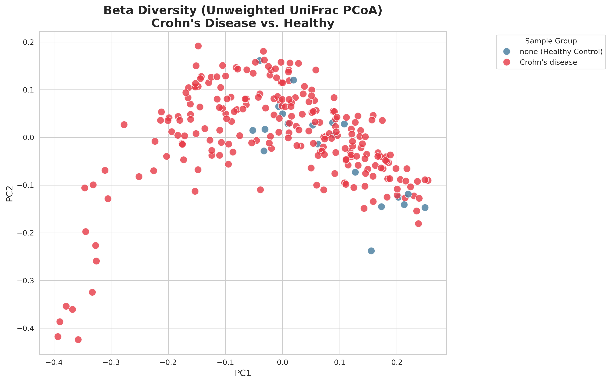
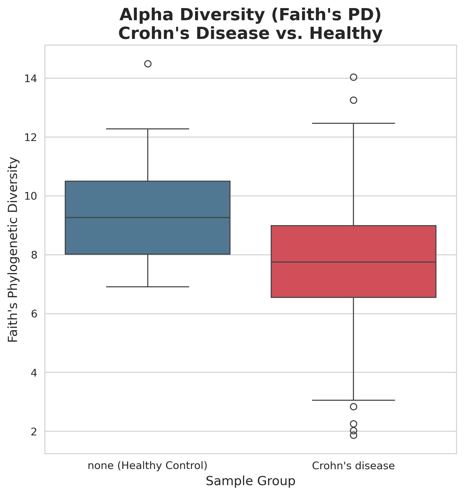
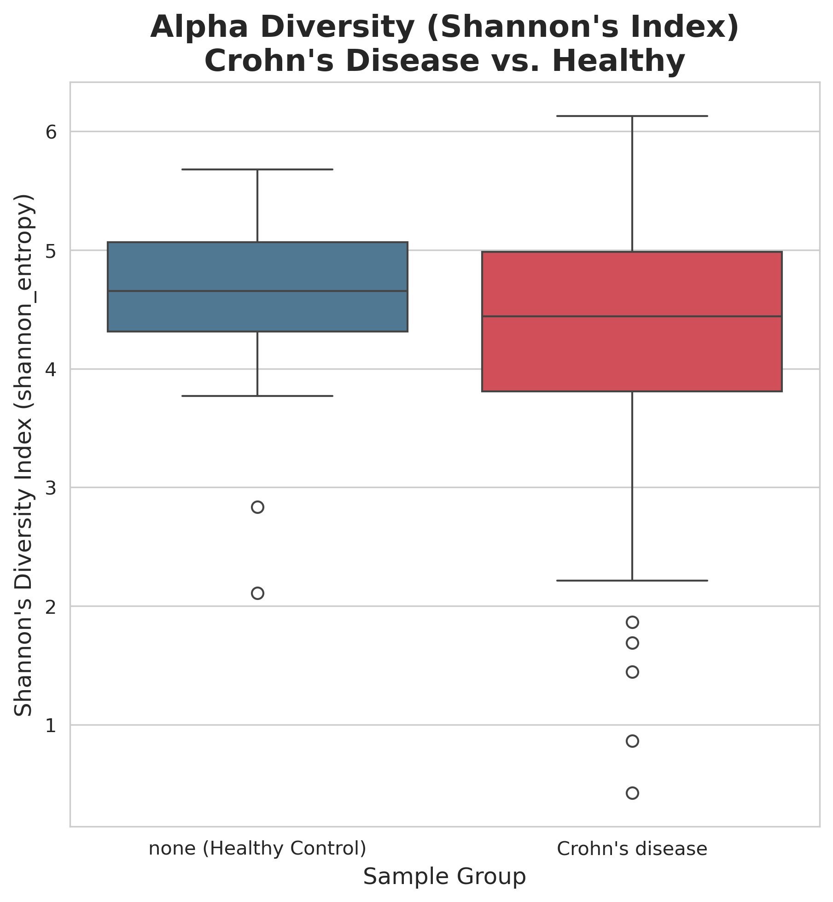

# 16S rRNA Microbiome Analysis: Crohn's Disease

This repository contains a complete 16S rRNA microbiome data analysis pipeline, from raw sequencing data (`.fastq`) to final statistical analysis and publication-quality visualizations. The project analyzes the gut microbiome composition in patients with Crohn's Disease (CD) compared to healthy controls.

The entire analysis is performed using **QIIME 2 (v2020.8)** run via **Docker**, with all steps documented in a series of Jupyter Notebooks.

---

## 🚀 Key Scientific Findings

Our analysis successfully identified a significant and robust **phylogenetic dysbiosis** in Crohn's Disease patients.

1.  **Beta Diversity (Overall Composition):** We found a highly significant difference in overall community structure between Crohn's and Healthy groups (**p-value = 0.0007**). The PCoA plot below shows a clear separation, with Healthy controls (blue) clustering tightly, while CD patients (red) are highly dispersed and separate.

    

2.  **Alpha Diversity (Internal Diversity):** This is the key finding. We found that:
    * **Phylogenetic Diversity (Faith's PD):** Was **significantly lower** (q=0.0006) in CD patients.
    * **Non-Phylogenetic Diversity (Shannon):** Showed **no difference** (q=0.28).

    **Conclusion:** The dysbiosis is not a simple loss of *how many* species, but a critical loss of *entire evolutionary branches* of the microbiome.

    | Faith's PD (Phylogenetic) - **Significant** | Shannon's Index (Non-Phylogenetic) - **Not Significant** |
    |:---:|:---:|
    |  |  |

---

## ⚙️ The Pipeline (Notebooks)

The project is broken down into 5 distinct, reproducible notebooks:

* **`01_Environment_Setup.ipynb`**:
    * Sets up the `mamba` environment.
    * Installs Jupyter, Pandas, and other dependencies.
    * Pulls the `qiime2/core:latest` Docker image.

* **`02_Data_Import_and_Denoising.ipynb`**:
    * Imports raw `.fastq` files (255 samples) into a QIIME 2 artifact (`.qza`).
    * Performs quality control, trimming, and denoising using **DADA2** (`qiime dada2 denoise-paired`).
    * Generates the final Feature Table (`table.qza`) and Representative Sequences (`rep-seqs.qza`).

* **`03_Taxonomy_and_Filtering.ipynb`**:
    * Downloads the SILVA 138 reference database.
    * Assigns taxonomy to all ASVs using a pre-trained Naive Bayes classifier.
    * Filters out contaminants (Mitochondria, Chloroplasts) to create `table-filtered.qza`.

* **`04_Diversity_Analysis.ipynb`**:
    * Builds a phylogenetic tree (MAFFT -> FastTree).
    * Runs the `core-metrics-phylogenetic` pipeline to calculate all alpha and beta diversity metrics (e.g., Shannon, Faith's PD, Unweighted UniFrac).
    * Runs statistical tests (`alpha-group-significance` and `beta-group-significance`) to generate the statistical artifacts.

* **`05_Results_Interpretation_and_Visualization.ipynb`**:
    * **This notebook generates all the plots shown above.**
    * Exports the statistical results (`.qzv`) using `qiime tools export`.
    * Loads p-values and coordinates into `pandas`.
    * Uses `seaborn` and `matplotlib` to create and save the final, publication-quality PNG visualizations.